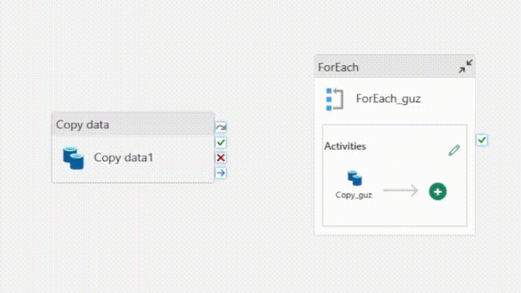
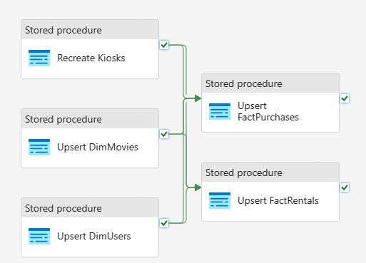
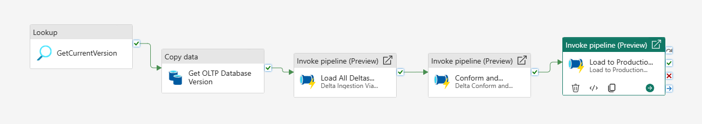

# Ingesting just our database changes into Fabric
A common need, especially when trying to make data pipelines more efficient, is to ingest just the changes (or deltas) from our source databases.

We handle that in this specific scenario by using the Change Tracking feature built into SQL Azure Database. But there are a number of ways
that we could handle it including Database Mirroring, CDC, or just plain watermarks.

As you will see, while the data load itself will be significantly more efficient, the workflows themselves will be much more complex.

### Step 1: Reingest our full data set
First we must reingest our full dataset and get a watermark of where we are so that moving forward all changes are captured. 

#### Step 1.1
Go to the **(1) Raw** workspace and open the `Full Raw Ingestion` pipeline. 

Add a Copy data activity by clicking Copy data, Add to canvas, and drag the added activity in front of the ForEach loop already present.

Click the Source tab in the Copy data activity, click the External radio button, Then select your SQL Azure database from the dropdown Connection menu. Select Azure SQL Database as the Connection type. 

Select the same database you load your data from as your Database. 
Click the Query radio button and paste in the below query into the Query text box.

```sql
SELECT CHANGE_TRACKING_CURRENT_VERSION() AS current_version, CURRENT_TIMESTAMP as current_version_timestamp
```

Next click the destination tab, select the Workspace radio button, select Warehouse in the Workspace data store type drop down, and select `VersionTracking` from the warehouse list. 

    Info: We are using a warehouse here as a simple metadata database. While it isn't the most performant method, it is essentially free as part of the capacity.

Next select the Auto create table radio button for the Table option. Use `dbo` as the schema name and `VersionTracking` as the table name.

Now, hover over the Copy data activity and click and drag from the green checkmark on the right side and connect the green arrow to the ForEach activity as shown below. This makes sure they run sequentially.



Finally, make sure to save your Pipeline, they do not save automatically.

#### Step 1.2
Now walk through running the full data load process again, starting with your newly edited pipeline. You may need to delete the InitialLoad folder before running. Once you have fully loaded everything all the way to your Production Warehouse you now have a starting snapshot to continue adding changes on top of.

### Step 2: Laying the groundwork
Now we will set up the notebooks and queries needed to conform, curate, and productionalize our data. But we won't be running them quite yet.

#### Step 2.1
Please import all three notebooks below by downloading them to your device and clicking New, Import Notebook in the **(2) Conformed** workspace.

- [(Delta Load) Conform Parquet to Delta](Notebooks/(Delta%20Load)%20Conform%20Parquet%20To%20Delta.ipynb)
- [DeltaSingleTable_ForParallel](Notebooks/DeltaSingleTable_ForParallel.ipynb)
- [(Delta Load) Curate Data](Notebooks/(Delta%20Load)%20Curate%20Data.ipynb)

Next, go through the three added notebooks and add the Default Lakehouses for each as mapped out below. 
- (Delta Load) Conform Parquet to Delta: SilverLakehouse
- DeltaSingleTable_ForParallel: SilverLakehouse
- (Delta Load) Curate Data: CuratedLakehouse

If you would like, you can read the Markdown cells for commentary about what each processing cell does.

    Note: We don't run the notebooks at this time as they are not able to to any processing without their parameters filled out via the pipelines.

#### Step 2.2
Let's move on to our Production Warehouse, navigate to the **(3) Production** workspace and open your Production Warehouse. Click New SQL Query and copy and paste the below linked queries into the window. Click run to add the stg schema, our stored procs, and views that are used in the data loading process.

- [(Delta Load) Production Stored Procs and Views](Queries/(Delta%20Load)%20Production%20Stored%20Procs%20and%20Views.sql)

### Step 3: Orchestration
Now let's put all the groundwork we created together into a series of pipelines that run our data engineering jobs in sequential steps.

#### Step 3.1
Let's create the first step pipeline that will load our data using the change tracking functions into the Raw/Bronze zone. 

Navigate to the **(1) Raw** workspace, click the *+ New* button and select Data Pipeline. Name it `Delta Ingestion Via Change Tracking` and click Create. 

Under *Start with a blank canvas* click the Pipeline activity tile. Scroll down on the menu to find the ForEach activity. 

Once in the pipeline canvas first click the blank grey background. We will add the pipeline parameters here. Click the Parameters tab and then the new button. The first parameter will be named items, select the Array type. Give it a default value of the information below.

```json
[{"source":{"schema":"app","table":"Inventory","joinon":"t.Id = CT.Id"},"destination":{"fileName":"appInventory.parquet"}},{"source":{"schema":"app","table":"Kiosk","joinon":"t.Id = CT.Id"},"destination":{"fileName":"appKiosk.parquet"}},{"source":{"schema":"app","table":"PurchaseLineItems","joinon":"t.Id = CT.Id"},"destination":{"fileName":"appPurchaseLineItems.parquet"}},{"source":{"schema":"app","table":"Purchases","joinon":"t.Id = CT.Id"},"destination":{"fileName":"appPurchases.parquet"}},{"source":{"schema":"app","table":"PurchaseUser","joinon":"t.PurchasesId = CT.PurchasesId AND t.PurchasingUsersId = CT.PurchasingUsersId"},"destination":{"fileName":"appPurchaseUser.parquet"}},{"source":{"schema":"app","table":"PurchaseUserCreditCard","joinon":"t.PurchasesId = CT.PurchasesId AND t.PaymentCardsId = CT.PaymentCardsId"},"destination":{"fileName":"appPurchaseUserCreditCard.parquet"}},{"source":{"schema":"app","table":"Rentals","joinon":"t.Id = CT.Id"},"destination":{"fileName":"appRentals.parquet"}},{"source":{"schema":"app","table":"Returns","joinon":"t.Id = CT.Id"},"destination":{"fileName":"appReturns.parquet"}},{"source":{"schema":"app","table":"UserAddresses","joinon":"t.Id = CT.Id"},"destination":{"fileName":"appUserAddresses.parquet"}},{"source":{"schema":"app","table":"UserCreditCards","joinon":"t.Id = CT.Id"},"destination":{"fileName":"appUserCreditCards.parquet"}},{"source":{"schema":"app","table":"UserReviews","joinon":"t.Id = CT.Id"},"destination":{"fileName":"appUserReviews.parquet"}},{"source":{"schema":"app","table":"Users","joinon":"t.Id = CT.Id"},"destination":{"fileName":"appUsers.parquet"}},{"source":{"schema":"app","table":"UserSubscriptionStatus","joinon":"t.Id = CT.Id"},"destination":{"fileName":"appUserSubscriptionStatus.parquet"}},{"source":{"schema":"dbo","table":"actors","joinon":"t.actor_id = CT.actor_id"},"destination":{"fileName":"dboactors.parquet"}},{"source":{"schema":"dbo","table":"actorstomoviesjoin","joinon":"t.actor_id = CT.actor_id AND t.movie_id = CT.movie_id"},"destination":{"fileName":"dboactorstomoviesjoin.parquet"}},{"source":{"schema":"dbo","table":"criticreviews","joinon":"t.critic_review_id = CT.critic_review_id"},"destination":{"fileName":"dbocriticreviews.parquet"}},{"source":{"schema":"dbo","table":"directors","joinon":"t.director_id = CT.director_id"},"destination":{"fileName":"dbodirectors.parquet"}},{"source":{"schema":"dbo","table":"directorstomoviesjoin","joinon":"t.director_id = CT.director_id AND t.movie_id = CT.movie_id"},"destination":{"fileName":"dbodirectorstomoviesjoin.parquet"}},{"source":{"schema":"dbo","table":"genres","joinon":"t.genre_id = CT.genre_id"},"destination":{"fileName":"dbogenres.parquet"}},{"source":{"schema":"dbo","table":"movies","joinon":"t.movie_id = CT.movie_id"},"destination":{"fileName":"dbomovies.parquet"}}]
```

The information above is a modified version of the object created by the Copy Data tool, but has had the Change Tracking join information added for each table.

Now click the New button again to add one more parameter, it's name will be `current_version`, type of String, and a default value of 1

Once our parameters are created, next click the ForEach activity on the canvas. Click the Settings tab. Click the Items text box, finally click the *Add dynamic content* link that appears. 

In the new textbox that appears paste `@pipeline().parameters.items` this statement tells the for each loop to use the Items parameter as it's data source. Click OK.

Next, click the edit Pencil next to the Activities label on the ForEach activity. Now you are in a blank canvas that will contain the activities that will be ran by the ForEach loop.

Click the Copy data button, and Add to canvas.

Once added, click the Source tab to start setting up our data source. Choose the External radio button. Select the database connection you created as part of the Raw ingestion steps. Select the connection type of Azure SQL Database. Select the database. 

For the Use query option select the Query radio button. Click the Query text box and then click the *Add dynamic content* link that appears. In the new text box that appears paste the below query.

```sql
SELECT
    t.*
FROM
    @{item().source.schema}.@{item().source.table} AS t
RIGHT OUTER JOIN
    CHANGETABLE(CHANGES @{item().source.schema}.@{item().source.table}, @{pipeline().parameters.current_version}) AS CT
ON
    @{item().source.joinon}
```

This is the default query that will get any row that has changed from a table since the last Change Tracking Version. Click OK.

#### Step 3.2 
Navigate back to the **(1) Raw** workspace and create another new Data Pipeline. 

Under *Start with a blank canvas* click the Pipeline activity tile. Scroll down on the menu to find the Notebook activity. 

Once in the pipeline canvas first click the blank grey background. We will add the pipeline parameters here. Click the Parameters tab and then the new button. The parameter will be named `current_version`, Type String, and Default value of 1.

Click the Notebook activity and first name it `Conform Data to Delta`. Then click the Settings tab, select the **(2) Conformed** Workspace, then select the `(Delta Load) Conform Parquet to Delta` notebook. Expand Base parameters, click new and name the parameter `current_version`, type String, Click the Value text box and then click the *Add dynamic content* link. In the new textbox that opens paste `@pipeline().parameters.current_version` and click OK.

Click the Notebook button in the tool bar to add another Notebook activity. Click this to select it and rename it `Curate Data`. Click Settings, select the **(2) Conformed** workspace, and then select the (Delta Load) Curate Data notebook. 

Connect the Conform Data to Delta activity to the Curate Data activity by clicking on the green check mark and dragging the green arrow to the Curate Data activity.

Make sure to click the Save button on the top left hand of the toolbar when complete.

#### Step 3.3
For this section we are going to have to do a bit of a work around to allow us to run stored procedures in a Warehouse that is not in the same workspace as our pipeline.

First navigate to the **(3) Production** workspace. Hover over the Production Warehouse, click the three dots, and then click *Copy SQL connection string*. In the popup, click the copy button to copy the FQDN to access the SQL endpoint. Save this somewhere for the next step.

Navigate back to the **(1) Raw** workspace and create another new Data Pipeline named `Load to Production Warehouse`.

Under *Start with a blank canvas* click the Pipeline activity tile. Scroll down on the menu to find the Stored Procedure activity.

Name the new stored procedure activity `Recreate Kiosks`, then click the Settings tab. Change the Data store type to External click the *+ New* button behind the Connection drop down. Select *Azure SQL Database* and click Continue button. 

Paste the ProductionWarehouse SQL Endpoint FQDN into the Server field. Enter ProductionWarehouse as the Database name. Change the Authentication kind to *Organizational account*. Then click the sign in button and sign in as your user. Then click OK. 

Select the ProductionWarehouse in the Database dropdown. Then select [dbo].[RecreateDimKiosks] in the Stored procedure name dropdown.

Next, verify you have the Recreate Kiosks activity selected and click the Clone button (it looks like two pages on top of each other) 4 times. You should now have 5 total Stored procedure activities. 

Click on each and change the names and the stored procedure they point to according to the table below.

| Tables                         | Stored Procedure            |
|--------------------------------|-----------------------------|
| Upsert DimMovies               | [dbo].[UpsertDimMovies]     |
| Upsert DimUsers                | [dbo].[UpsertDimUsers]      |
| Upsert FactPurchases           | [dbo].[UpsertFactPurchases] |
| Upsert FactRentals             | [dbo].[UpsertFactRentals]   |

Finally connect the activities to make the the two fact stored procs dependent on the three dimensions finishing successfully. Hover over the activity, Click and drag from the green check mark to the next activity. Once finished with all of the activities, it should look like the screenshot below.



Click save to make sure you do not lose your changes.

#### Step 3.4
Let's make our final pipeline that will orchestrate getting our current change tracking version, and then running our data loads sequentially. 

Navigate to the **(1) Raw** workspace and create another new Data Pipeline named `Orchestration`. 

Under *Start with a blank canvas* click the Pipeline activity tile. Scroll down on the menu to find the Lookup activity.

Name the Lookup activity `GetCurrentVersion`. Click the Settings tab, make sure the Workspace Data store type is selected, Workspace data store type of Warehouse, select the Warehouse VersionTracking, for the Use query section select Query, paste in the query

```sql
SELECT current_version, current_version_timestamp FROM VersionTracking ORDER BY current_version_timestamp DESC
```

Make sure *First row only* is checked.

Next, add a new Copy Data activity, name it `Get OLTP Database Version`, click the Source tab, select the Data store type of External, select the Connection of your SQL Azure Database, change the connection type to Azure SQL Database, and select your database. Select the Query radio button. Paste the below query into the Query text box.

```sql
SELECT CHANGE_TRACKING_CURRENT_VERSION() AS current_version, CURRENT_TIMESTAMP as current_version_timestamp
```

Click the Destination tab, Select the Workspace Radio button, Warehouse Data store type of Warehouse, the Table option of Use existing, and select the Table dbo.VersionTracking.

Next add an Invoke Pipeline Activity. Name this activity `Load All Deltas from Change Tracking`. Click the Settings tab and select the `Delta Ingestion Via Change Tracking` pipeline. Make sure *Wait on completion* is checked. Click the Value text box for the *current_version*, and then click the *Add dynamic content* link. Paste `@activity('GetCurrentVersion').output.firstRow.current_version` into the text box that appears and click Ok.

Add another Invoke Pipeline activity and name this one `Conform and Curate Changes`. Click the Settings tab and select the `Delta Conform and Curate` pipeline. Make sure *Wait on completion* is checked. Click the Value text box for the *current_version*, and then click the *Add dynamic content* link. Paste `@activity('GetCurrentVersion').output.firstRow.current_version` into the text box that appears and click Ok.

Add another Invoke Pipeline activity and name this one `Load to Production DW`. Click the Settings tab and select the `Load to Production Warehouse` pipeline. Make sure *Wait on completion* is checked.

Connect all the activities in order to make sure they run in order. When complete the pipeline should match the image below. 



Make sure to save your pipeline.

#### Step 3.5
Let's finish by scheduling our pipeline to run every 15 minutes so we are always getting our changed data. 

Make sure you are still in the `Orchestration` pipeline. Click the schedule button. In the Schedule section, click the On radio button. Select *By the minute* in the Repeat dropdown. Select the current Date and Time for the Start date and time, and a time far in the future for the End date and time. Finally, click Apply.

### Complete!
You have now completed all the steps to transfer the data using a Change Tracking process!